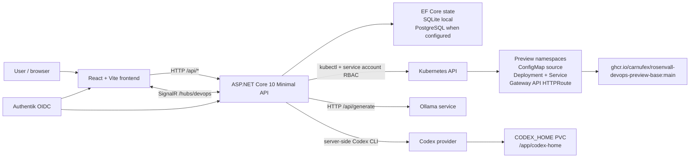

# Rosenvall DevOps MVP

This is the first vertical slice of the DevOps SaaS plan.

## Shape

- `src/Rosenvall.DevOps.Core`: tested domain primitives for work item status flow, AI approval, and preview naming.
- `src/Rosenvall.DevOps.Api`: ASP.NET Core 10 Minimal API with SignalR update hub and v1 endpoint contracts.
- `frontend`: React + TypeScript UI matching the supplied Rosenvall DevOps design direction.
- `workflows`: GitHub Actions templates for target repositories that will run implementation agents.
- Boards are repository-bound. RDO can model Forgejo/Gitea, GitHub, Azure DevOps, and generic Git remotes.
- Timeline events combine card lifecycle, preview events, PR callbacks, commits, and pipeline runs.
- Forgejo/Gitea is the first self-hosted Git target. The current policy is `LinkExistingFirst`, with repository creation exposed as configuration before wiring credentials.
- Pipeline runs can render and submit Kubernetes Jobs, then expose token and code-delta metrics to the dashboard.
- Assignee options can come from Authentik configuration plus the current board's existing assignees.

The API seeds demo data on first run and persists state through EF Core. Local development uses SQLite when `ConnectionStrings__DevOps` is empty. Cluster runtime should provide `ConnectionStrings__DevOps` for CloudNativePG. The Kubernetes scaffold stages the PostgreSQL manifest but does not sync it until the secret contract exists.

## Architecture and Tech Stack

Rosenvall DevOps is a React frontend backed by an ASP.NET Core API. The browser uses HTTP for commands and queries against `/api/*`, and keeps board, card, preview, and AI progress fresh through the SignalR hub at `/hubs/devops`.



The backend orchestrates the product workflow. It owns the board state, AI run records, comment history, preview lifecycle, pipeline manifests, and Kubernetes health checks. In local development `kubectl` uses the configured kubeconfig path. In homelab the API image includes `kubectl`, `Preview__KubeconfigPath` is empty, and Kubernetes auth comes from the `rosenvall-devops-runtime` service account and RBAC.

AI planning is provider-based. The `ollama` provider calls an Ollama HTTP endpoint, usually `http://localhost:11434/api` locally or `http://ollama.ollama.svc.cluster.local:11434/api` in homelab. The `codex` provider runs Codex CLI inside the API pod or local API process, using server-side auth from `CODEX_HOME`; Codex tokens are never sent to the browser. Homelab currently defaults to `codex`, with `ollama` available as a fallback provider.

Preview apps are generated as per-ticket React/Tailwind source files, stored in a Kubernetes ConfigMap, and mounted into the prewarmed `rosenvall-devops-preview-base` image. The preview lifecycle is tracked separately from `kubectl apply`: the UI only exposes the public demo URL after the backend health checker sees an available Deployment and a ready pod.

Tech stack:

- Frontend: React 19, TypeScript, Vite, dnd-kit, `oidc-client-ts`, and `lucide-react`.
- Backend: .NET / ASP.NET Core 10, Minimal API, SignalR, EF Core, SQLite for local state, and PostgreSQL support when configured.
- AI: Ollama HTTP plan provider, Codex CLI plan provider, and Codex CLI preview-source generation.
- Runtime and deploy: Kubernetes, Gateway API `HTTPRoute`, GHCR images, Authentik OIDC, Cloudflare tunnel / Zero Trust, and service-account RBAC.

## Local Run

One-command local demo:

```powershell
.\scripts\start-local-demo.ps1
```

Then open `http://localhost:5173`.

Stop it with:

```powershell
.\scripts\stop-local-demo.ps1
```

Manual API run:

```powershell
dotnet run --project .\src\Rosenvall.DevOps.Api\Rosenvall.DevOps.Api.csproj --urls http://localhost:5088
```

Frontend:

```powershell
cd .\frontend
npm install
npm run dev
```

Open `http://localhost:5173`.

## React/Tailwind Preview Example

The v1 implementation example is now end-to-end inside the app:

1. Create a work item named `hello world`.
2. Click `Generate AI plan`.
3. Approve the plan.
4. The API runs the local React/Tailwind implementation runner, creates a preview record, and returns a demo URL like `https://task-4825-hello-world.rosenvall.se`.
5. Fetch the Kubernetes manifest from `GET /api/previews/{workItemId}/manifest`.

The manifest runs `ghcr.io/carnufex/rosenvall-devops-preview-base:main` with per-ticket Vite/React/Tailwind source mounted from a ConfigMap. The base image is prewarmed with shared npm dependencies so preview pods do not run `npm install` at startup.

To apply a generated preview to the cluster:

```powershell
.\scripts\apply-preview.ps1 -WorkItemId <work-item-guid> -Kubeconfig ..\..\tofu\output\kubeconfig
```

Use the path to your own Kubernetes kubeconfig when running outside the homelab repository.

For public `https://<slug>.rosenvall.se` access, Cloudflare Zero Trust must publish `*.rosenvall.se` to the external Gateway with `Match SNI to Host` enabled. The tunnel is token-managed, so that published hostname is configured in Cloudflare, not only through the in-cluster ConfigMap.

Docker Compose demo:

```powershell
docker compose -f .\compose.yaml up --build
```

## Homelab Deploy

Product-side manifests live in `deploy/homelab`:

```powershell
kubectl apply -k .\deploy\homelab
```

The manifests publish `https://devops.rosenvall.se`, configure Authentik OIDC for the frontend/API, point Ollama at `http://ollama.ollama.svc.cluster.local:11434/api`, install Codex CLI in the API pod with a mounted `/app/codex-home`, and give the API service account RBAC to create preview and pipeline Kubernetes resources.

To enable the `codex` AI provider in homelab, log in once inside the API pod:

```powershell
kubectl -n rosenvall-devops exec -it deploy/rosenvall-devops-api -- codex login --device-auth
```

The login state is stored in the `rosenvall-devops-codex-home` PVC. Homelab defaults to the `codex` provider, and `ollama` remains available as a fallback.

## Implemented API Contracts

- `GET /api/workspaces`
- `POST /api/workspaces`
- `GET /api/workspaces/{workspaceId}/boards`
- `POST /api/workspaces/{workspaceId}/boards`
- `GET /api/repositories`
- `POST /api/repositories`
- `GET /api/boards/{boardId}`
- `GET /api/boards/{boardId}/timeline`
- `GET /api/work-items`
- `POST /api/work-items`
- `GET /api/work-items/{workItemId}`
- `PATCH /api/work-items/{workItemId}`
- `DELETE /api/work-items/{workItemId}`
- `POST /api/work-items/{workItemId}/move`
- `POST /api/work-items/{workItemId}/comments`
- `POST /api/work-items/{workItemId}/ai-plan`
- `GET /api/work-items/{workItemId}/ai-runs`
- `POST /api/ai-runs/{aiRunId}/approve`
- `POST /api/ai-runs/{aiRunId}/discard`
- `POST /api/integrations/github/callback`
- `GET /api/metrics`
- `GET /api/assignees`
- `POST /api/pipeline-runs`
- `POST /api/pipeline-runs/{pipelineRunId}/execute`
- `GET /api/pipeline-runs/{pipelineRunId}/manifest`
- `GET /api/previews/{workItemId}/manifest`
- `GET /api/settings`

## Next Production Steps

- Provide the PostgreSQL bootstrap secret and `ConnectionStrings__DevOps` before enabling CloudNativePG runtime in ArgoCD.
- Add real Forgejo and Authentik API tokens as Kubernetes secrets, then replace configured/static user and repository data with live API calls.
- Publish immutable image tags from CI and pin `deploy/homelab` to those tags instead of `:main`.
