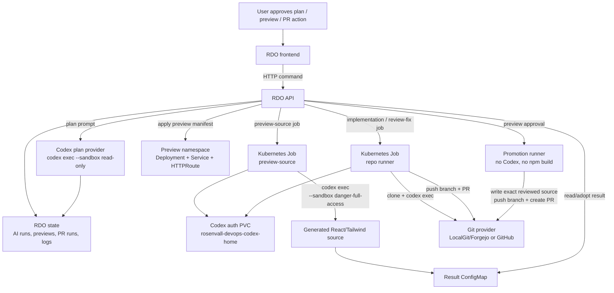

# Codex integration

Rosenvall DevOps använder Codex som en server-side AI-provider. Webbläsaren får aldrig Codex-token eller `CODEX_HOME`; API:t och Kubernetes-jobben kör Codex åt användaren och streamar status/loggar tillbaka till UI:t.

## Lägen

Codex används i tre olika lägen:

- **AI-planering**: API:t kör `codex exec` lokalt i API-processen med `--sandbox read-only`. Resultatet sparas som en AI-plan på kortet.
- **Preview-source**: API:t startar ett Kubernetes-jobb som kör Codex i en tillfällig workspace och producerar deploybara React/Tailwind-filer. Resultatet publiceras som en ConfigMap och API:t deployar sedan preview-miljön.
- **Repository implementation / PR review fix**: API:t startar ett Kubernetes-jobb som klonar repo, kör Codex mot en prompt, validerar ändrade filer, pushar branch och skapar/uppdaterar PR.

`Approve preview and create PR` är medvetet inte ett Codex-läge. Det är ett rent promotion-flöde: runnern klonar repo, skriver exakt de preview source-filer som användaren redan godkänt, pushar branch och skapar PR.

## Säkerhet och sandbox

- Codex-autentisering ligger i serverns `CODEX_HOME`, i homelab som PVC:n `rosenvall-devops-codex-home`.
- Kubernetes-runnerjobb får en isolerad `CODEX_HOME` via `emptyDir`; auth/config kopieras från PVC:n innan Codex körs.
- Repository implementation- och preview-source-jobb använder `--sandbox danger-full-access` eftersom Kubernetes-podden är sandboxgränsen. Poddarna kör som icke-root, med capabilities droppade och utan onödiga service account tokens.
- Planering körs med `--sandbox read-only` eftersom den inte ska modifiera filer.
- Preview-source Codex-containern har ingen Kubernetes service account token. En separat publisher-container får en projected token för att skriva resultat-ConfigMap.
- Repository tokens skapas som kortlivade Kubernetes Secrets och ska inte sparas i RDO snapshot eller loggar.

## Konfiguration

Viktiga inställningar:

- `Ai__DefaultProvider=codex` väljer Codex som standardprovider.
- `Ai__Codex__Path` pekar på Codex CLI, normalt `codex`.
- `Ai__Codex__Home` pekar på serverns Codex home, t.ex. `/app/codex-home`.
- `Ai__Codex__Model` och `Ai__Codex__ReasoningEffort` styr modell och reasoning-effort.
- `Ai__Codex__PreviewSourceMode=kubernetes-job` kör preview-source i Kubernetes i stället för i API-processen.
- `Ai__Codex__KubernetesRunnerImage` styr vilken API-runnerimage som används i Kubernetes-jobben.
- `Ai__Codex__KubernetesSandboxMode=danger-full-access` är standard för Kubernetes-runnerjobb.

## Felhantering

RDO försöker göra Codex-flöden idempotenta:

- Preview-source recovery läser först befintligt result ConfigMap innan det startar om Codex.
- Om API:t restartar under preview-source försöker RDO reattacha till befintligt Kubernetes-jobb eller adoptera resultatet.
- `bwrap`/bubblewrap-fel klassas som att Codex sandbox inte är tillgänglig i runnern, i stället för att visas som generiskt "No changes produced".
- Terminalrader delas upp per steg i UI:t så användaren kan se vad som hände under planering, preview, PR creation, implementation och cleanup.

